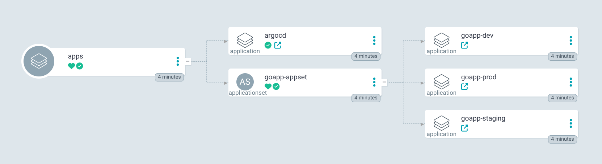
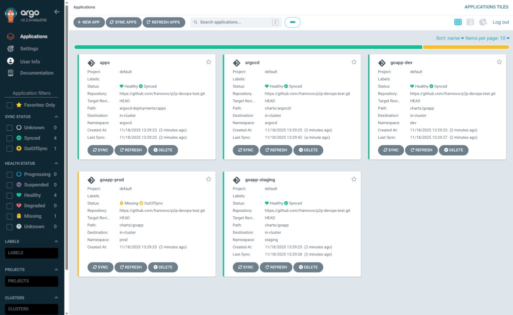

# P2P DevOps

This repositry implements a complete CI/CD pipeline for a Go application deployed into Kubernetes.

## Requirements

Following tools are required to run this repository:

- [pre-commit](https://pre-commit.com/#install)
- [Docker](https://docs.docker.com/engine/install/)
- [Helm](https://helm.sh/docs/intro/install/)
- [Kubectl](https://kubernetes.io/docs/tasks/tools/install-kubectl/)
- [Kind](https://kind.sigs.k8s.io/)

## Architecture Overview

### Folder Structure

```
.
├── .github
│   └── workflows          # CI/CD pipelines definitions
├── argocd-deployments     # ArgCD root apps folder
│   ├── applications.yaml  # Apps of Apps
│   └── apps
├── charts                 # Helm Charts
│   ├── argocd
│   └── goapp              
├── deploy                 # Kuberenets deployment scripts
│   ├── config.yml
│   ├── delete.sh
│   ├── create.sh
├── Dockerfile
├── docs
├── go.mod
├── main.go
├── main_test.go
└── README.md
```

### Helm Charts

Kubernetes resources are defined using Helm charts in the [charts](./charts) folder. In addition, [argocd-deployments](./argocd-deployments) folder contains the ArgoCD root application and application/application-set resources to bootstrap the cluster.

The [argocd](./charts/argocd/) chart defines ArgoCD server configuration and CRD resources (projects, repositories).

The [goapp](./charts/goapp/) chart defines the Go application resources.


### CI/CD

CI/CD is implemented using GitHub actions and GitOps with ArgoCD. Workflows can be found in [.github/workflows](.github/workflows) folder.


#### Workflows

- [ci.yaml](.github/workflows/ci.yaml). Build and test the go application. Automated every push. 
- [sast.yaml](.github/workflows/sast.yaml). Static Application Security Testing using gosec. Automated on PR creation/sync.
- [sca.yaml](.github/workflows/sca.yaml). Software Composition Analysis using nancy. Automated on PR creation/sync.
- [cd.yaml](.github/workflows/cd.yaml). Build and Publish Docker Image. Update the image tag. Automated push to master/staging/develop branch.

#### Repository Variables

`HELM_CHART_PATH`: path to application helm chart (e.g charts/goapps)


### Set Up

The deploy scripts ([create.sh](scripts/create.sh)) creates a kind cluster with one master and three workers nodes.


In addition, the script installs ArgoCD using Helm, and bootstrap the cluster by installing the ArgoCD root application (apps).




## Deployment Instructions

Clone the repostiry

```bash
git clone https://github.com/frannovo/p2p-devops-test-gitflow.git
cd p2p-devops-test-gitflow
```

### Create the Cluster

Create the cluster and set up ArgoCD

```bash
bash deploy/create.sh
```

```bash
[INFO] Starting ArgoCD setup on Kind cluster: p2p-devops
[INFO] Cluster 'p2p-devops' not found. Creating with config: /path/to/p2p-devops-test-gitflow/deploy/config.yml
Creating cluster "p2p-devops" ...
 ✓ Ensuring node image (kindest/node:v1.33.1) 🖼
 ✓ Preparing nodes 📦 📦 📦 📦  
 ✓ Writing configuration 📜 
 ✓ Starting control-plane 🕹️ 
 ✓ Installing CNI 🔌 
 ✓ Installing StorageClass 💾 
 ✓ Joining worker nodes 🚜 
 ✓ Waiting ≤ 1m0s for control-plane = Ready ⏳ 
 • Ready after 6s 💚
Set kubectl context to "kind-p2p-devops"
You can now use your cluster with:

kubectl cluster-info --context kind-p2p-devops

Thanks for using kind! 😊
Set kubectl context to "kind-p2p-devops"
[INFO] Installing/ArgoCD via Helm in namespace 'argocd'...
Release "argocd" does not exist. Installing it now.
NAME: argocd
LAST DEPLOYED: Tue Nov 18 12:31:44 2025
NAMESPACE: argocd
STATUS: deployed
REVISION: 1
TEST SUITE: None
[INFO] Waiting for secret/argocd-initial-admin-secret to be created in namespace 'argocd'...
[INFO] ArgoCD initial admin secret is ready (password populated)!
[INFO] Applying ArgoCD root Application...
application.argoproj.io/apps created
[INFO] Retrieving ArgoCD admin password..
========================================
  ArgoCD is ready!
  Username: admin
  Password: ***********
========================================

Access the UI:
  kubectl port-forward svc/argocd-server -n argocd 8080:443
  Then open: https://localhost:8080
```

The UI should looks like this:



### Delete the Cluster

Delete the Kind cluster and clean up all resources.

```bash
bash deploy/delete.sh
[INFO] Deleting p2p-devops

You are about to PERMANENTLY DELETE the following Kind cluster:

     p2p-devops

This will destroy all pods, volumes, networks, and data, ArgoCD, apps, etc.

To confirm deletion, type the cluster name exactly:
 p2p-devops -> p2p-devops

[INFO] Deleting cluster 'p2p-devops'...
Deleting cluster "p2p-devops" ...
Deleted nodes: ["p2p-devops-worker2" "p2p-devops-control-plane" "p2p-devops-worker3" "p2p-devops-worker"]

[INFO] Cluster 'p2p-devops' has been successfully deleted.
```

## GitHub and Environments

### Environments

Dev, Staging and Production environments are deployed into `dev`, `staging` and `prod` namespaces
on the Kubernetes cluster respectively.

Auto sync is enabled in lower environments (`dev` and `staging`), meawhile manual sync is required to 
deploy into `prod` environment.

### GitHub Flow

This repository follows GitHub flow based on a master branch and short-living branches.

When a pull request (PR) is merged to master, a new docker images is built and pushed to `ghrc.io` with
the related commit sha as tag. The new image is automatically deployed to the `dev` environment.

Once the version is ready to be promoted, it can be deployed to the `staging` environment executing the 
[Promote to Staging](.github/workflows/promote-to-staging.yml) workflow providing the image tag.


Promotion to production is performed by executing [Promote to Production](.github/workflows/promote-to-prod.yml)
workflow providing the image tag. If no image tag is provided, the image tag will be picked up from staging values file
[values-staging.yaml](charts/goapp/values-staging.yaml)


## TODO Improvements

- Improve pre-commit hooks configuration
- Add paths-ignore on github actions to prevent trigger pipelines when it is not needed
- Add semantic versioning tagging and automate release workflow
- Improve workflow organization for reusability
- Use trivy for dependency vulnerability scanning and secrets scanning
- Add SAST for the goapp helm chart using trivy
- Add ServiceMonitor for goapp application monitoring
- Add attestation to sign build provenance (https://github.com/actions/attest-build-provenance)
- Configure repository level security settings
